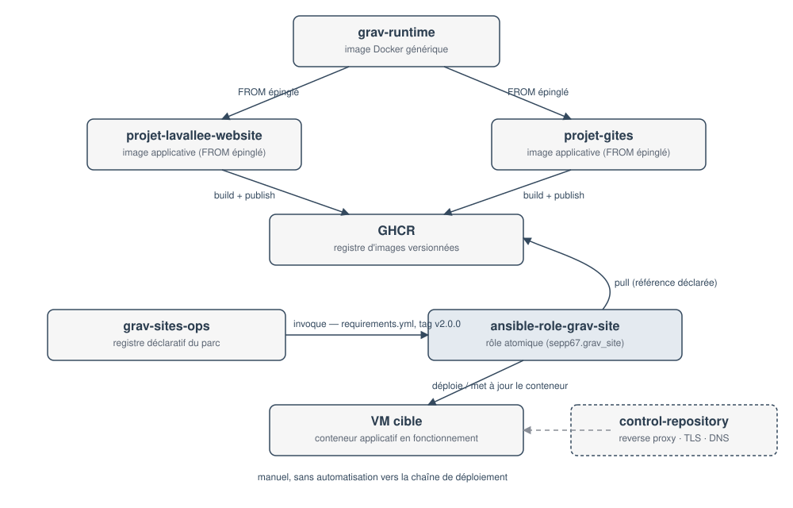

## Quel problème la plateforme résout-elle ?

Sébastien Lavallée exploite plusieurs sites Grav (lavallee.tech, un site de
gîtes, et ce site de documentation) sur un parc de VM. Sans architecture
commune, chaque site réinventerait son propre Dockerfile, son propre
mécanisme de déploiement et sa propre gestion des secrets — au prix d'une
dérive progressive entre sites et d'un risque de secret oublié dans un
dépôt.

La plateforme répond à cela en séparant quatre responsabilités qui changent
à des rythmes différents et n'ont pas les mêmes lecteurs :

| Composante | Répond à la question |
|---|---|
| `grav-runtime` | Comment Grav tourne-t-il, indépendamment de tout site ? |
| une image applicative (`projet-lavallee-website`, `projet-gites`, `grav-platform-docs`) | Quel est le contenu et le comportement d'**un** site précis ? |
| `ansible-role-grav-site` | Comment déployer **une** instance de site, de façon reproductible ? |
| `grav-sites-ops` | Quel est l'état désiré de **l'ensemble du parc**, et qui a le droit d'y toucher ? |

## Pourquoi séparer runtime, image applicative, rôle atomique et orchestration ?

Chaque frontière évite un couplage précis :

- **runtime / image applicative** — sans cette séparation, corriger une
  faille PHP-FPM obligerait à reconstruire et retester chaque site un par
  un. Avec elle, `grav-runtime` se met à jour une fois ; chaque image
  applicative choisit *quand* elle épingle la nouvelle version (cahier §4.2).
- **image applicative / rôle de déploiement** — sans cette séparation, le
  mécanisme de déploiement deviendrait spécifique à un site, invérifiable
  indépendamment de son contenu métier. Avec elle, `ansible-role-grav-site`
  ne connaît qu'une référence d'image et des variables publiques ; il
  déploierait n'importe quelle image conforme au contrat de `grav-runtime`,
  pas seulement celles qui existent aujourd'hui.
- **rôle atomique / orchestration du parc** — sans cette séparation,
  ajouter un site obligerait à dupliquer toute la logique de déploiement.
  Avec elle, `ansible-role-grav-site` déploie *une* instance sans savoir
  qu'un parc existe ; `grav-sites-ops` ne connaît que le registre déclaratif
  et invoque le rôle une fois par site sélectionné.

## Quelle composante construit quoi ?

- `grav-runtime` construit l'image de base (PHP-FPM + Nginx + Grav Core/Admin).
- Chaque image applicative (`projet-lavallee-website`, `projet-gites`,
  `grav-platform-docs`) construit sa propre image à partir d'un tag précis
  de `grav-runtime`, puis la publie sur GHCR.
- `ansible-role-grav-site` **ne construit jamais d'image** : il consomme une
  référence déjà publiée.
- `grav-sites-ops` **ne construit rien** non plus : il déclare quelle
  référence d'image chaque instance doit utiliser, et invoque le rôle pour
  la déployer.

## Diagramme de composants



Le rôle ne connaît que l'image ; `grav-sites-ops` ne connaît que le rôle. Le
reverse proxy, TLS et le DNS relèvent d'un `control-repository` séparé, qui
n'est appelé par aucune automatisation de cette chaîne (détaillé dans
[Responsabilités et frontières](../02.responsabilites-et-frontieres)).

---

```yaml
Sources documentées : grav-runtime (v1.0.4, e6e35c37bce2d214b4fb2ca77549f7bec7eed3d4) — Dockerfile ;
                       projet-lavallee-website (main, c4341ca77270565969e1e801e11a8fda72e5b402) — Dockerfile ;
                       ansible-role-grav-site (v2.0.0, 1339e50bc20257fbb9f21953995c08262ae3043e) — README.md ;
                       grav-sites-ops (v1.0.0, 48b9a59b956f73f10e5602b72a222dd71b4a3f3a) — docs/ARCHITECTURE.md
Détail complet du périmètre audité par dépôt : voir docs/documentation-sources.yml
Dernière vérification : 2026-09-11
```
