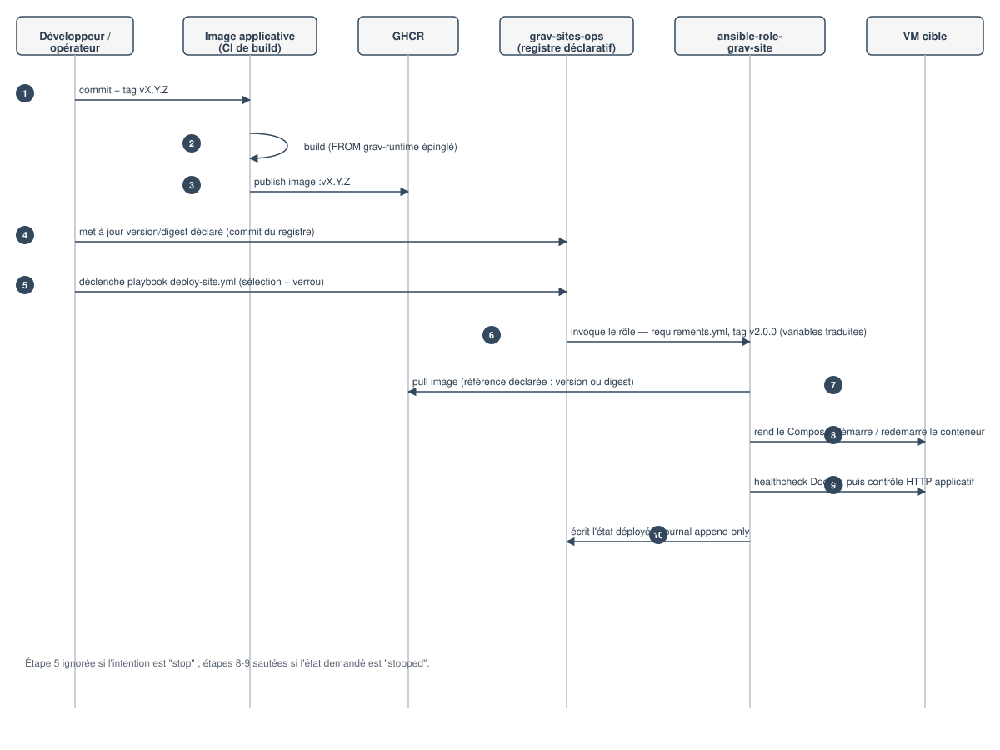

## Comment une modification traverse-t-elle le système ?

Quatre étapes distinctes, jamais confondues, séparent un commit applicatif
de son exposition sur Internet :

1. **Build** — une image applicative est construite localement ou en CI, à
   partir d'un tag précis de `grav-runtime`.
2. **Publication** — l'image construite est poussée sur GHCR sous un tag
   explicite (jamais `latest`).
3. **Déploiement** — `ansible-role-grav-site`, invoqué par `grav-sites-ops`,
   tire cette image et démarre ou met à jour le conteneur sur la VM cible.
4. **Exposition Internet** — hors de cette chaîne : un `control-repository`
   séparé configure le reverse proxy, TLS et le DNS, sans automatisation
   depuis les trois étapes précédentes (voir [Responsabilités et
   frontières](../02.responsabilites-et-frontieres)).

Une instance peut donc être "déployée" (étape 3 terminée, healthcheck et
contrôle HTTP local au vert) sans être "exposée" (étape 4 pas encore faite)
— deux états distincts, jamais confondus dans cette documentation.

## Diagramme de séquence



## Exemple concret : `projet-lavallee-website`

1. Un commit sur `projet-lavallee-website` (aujourd'hui figé au commit
   `c4341ca77270565969e1e801e11a8fda72e5b402`) modifie le thème
   `lavallee-theme` ou le plugin `contact`.
2. L'image est construite avec `FROM ghcr.io/sepp67/grav-runtime:1.0.4`
   (version épinglée dans le `Dockerfile` du dépôt), puis publiée sur GHCR
   sous un nouveau tag.
3. Le registre déclaratif de `grav-sites-ops` (hors périmètre de
   `grav-platform-docs`, propriété de ce dépôt) référence ce nouveau tag ou
   digest pour l'instance `lavallee.tech`.
4. `ansible-role-grav-site`, invoqué avec `grav_image:
   ghcr.io/sepp67/projet-lavallee-website` et la nouvelle `grav_version`,
   tire l'image, redémarre le conteneur, vérifie le healthcheck Docker puis
   la page applicative.
5. Le reverse proxy de `control-repository`, déjà configuré pour
   `lavallee.tech`, continue de pointer vers l'adresse locale de la VM —
   aucune reconfiguration n'est nécessaire pour une simple mise à jour
   d'image.

## Exemple concret : `projet-gites`

Même chaîne, avec une différence notable : le thème `gites-theme` de
`projet-gites` embarque ses propres templates de gestion des disponibilités
et de galerie photo (`templates/gerer-disponibilites.html.twig`,
`templates/gite-photos.html.twig`, `templates/partials/galerie-*.html.twig`
— constatés par inspection directe du dépôt, audit complet réservé au
Lot 7). La chaîne de build → publication → déploiement ne change
pas d'une image applicative à l'autre : c'est précisément ce que garantit la
séparation runtime / image applicative / rôle — `ansible-role-grav-site`
déploie `projet-gites` exactement comme il déploie `projet-lavallee-website`
ou `grav-platform-docs`, sans connaître leur contenu métier respectif.

---

```yaml
Sources documentées : grav-runtime (v1.0.4, e6e35c37bce2d214b4fb2ca77549f7bec7eed3d4) — Dockerfile ;
                       projet-lavallee-website (main, c4341ca77270565969e1e801e11a8fda72e5b402) — Dockerfile ;
                       projet-gites (main, b27d7afa0c86461e94ab8c9ec53c557edb0afd0e) — README.md, grav/user/themes/gites-theme/templates/ ;
                       ansible-role-grav-site (v2.0.0, 1339e50bc20257fbb9f21953995c08262ae3043e),
                       grav-sites-ops (v1.0.0, 48b9a59b956f73f10e5602b72a222dd71b4a3f3a) — voir docs/documentation-sources.yml
Dernière vérification : 2026-09-11
```
